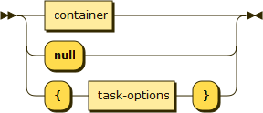
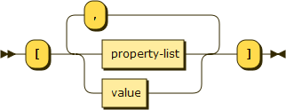
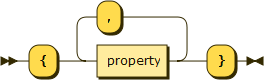
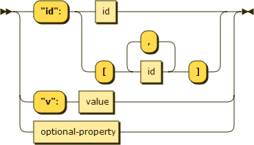
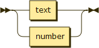
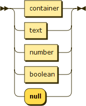

STAP (Simple Task-Actor Protocol) is a machine-readable format for specifying user-interface changes. 

Main focus of STAP is in providing a functionally-equivalent task experience for human and computational users alike.
In its focus to make human software usable by machine agents, STAP aims to eliminate non-task-essential design choices (e.g. font type/size may be irrelevant for many task types), leaving those to be optionally specified via customizable templates (e.g. CSS).

STAP messages adhere to JSON formatting, and can be deserialized with any standard JSON library.

Deploying a STAP application is similar to deploying a web application, where STAP takes place of HTML as the language for UI description.
Much like HTML, STAP is a means for serializing task interface display and interactions.
Unlike HTML documents, STAP messages are incremental updates to the display.
Whereas HTML is focused on hypertext look and feel, STAP is focused on function, structure, and affordances of UI elements (though it enables style-sheets for detailed look&feel specification).

Benefits of task development with STAP:
- less code, more GUI
- cross-platform, web-friendly
- millisecond precision time-stamps and timers
- consistent cross-task API, allowing computational agents to interact with the same sw that that human users interact with

Benefits of agent development for STAP-compliant tasks:
- consistent cross-task API, allowing computational agents to interact with the same sw that that human users interact with
- millisecond precision user-time [with faster-than-real-time and slower-than-real-time capabilities]
- cross-platform, web-friendly
- low bar of entry (i.e., core API for text-and-button tasks is minimal, additional UI feature handlers can be added to agent framework on a per-task basis)

###### Please see [stap.txt](stap.txt) for complete syntax and functionality.

***

[Demo](https://cdn.rawgit.com/stap7/stapjs/ee0cd1f4/demo.html)

***

Sample Interactions:

    <-     Message received by task software from user software
    ->     Message sent from task software to user software

    Sample Interaction 1:
        // user software ready
        <- [0,0,[0]]
        // display "Hello World"
        -> ["Hello World"]
        // display a "Click Me" button
        -> [{"id":"Click Me","v":false}]
        // user clicks the button after 30.8s
        <- [30800,"Click Me",true]

    Sample Interaction 2:
        // user software ready
        <- [0,0,[0]]
        // let user software know that "T" (timeout) and "eT" (editable-text field) are required directives for this task
        -> {"require":{"options":["T","eT"]}}
        // let user know that a goal in this task is to earn as close to 10 coins as possible
        -> {"task":{"good":[{"id":"Coins Earned","v":{">":0","closerTo":10}}]}}
        // display a text prompt to get user's name (eT:1 turns text editable)
        -> [{"id":"What is your name?","v":"","eT":1}]
        // user types in "Bob" and hits enter (9.876sec after task display first loaded)
        <- [9876,"What is your name?","Bob"]
        // clear display
        -> null
        // display two buttons
        -> [{"id":"choose a button","v":[{"id":"Button 1","v":false},{"id":"Button 2","v":false}]}]
        // first button was clicked after 12.307sec
        <- [12307,"Button 1",true]
        // give user reward, "Coins Earned"=7
        -> [{"id":"Coins Earned","v":7}]
        // wait 2 seconds and remove the Coins Earned display
        -> [{"T":2,"id":"Coins Earned","v":null}]
        // second button was clicked
        <- [15422,"Button 2",true]
        // give reward
        -> [{"id":"Coins Earned","v":3}]
        ...

###### Please see [stap.txt](stap.txt) for complete syntax and functionality.

***

## Core STAP syntax

### Message sent from task software to user-side software

- each task-to-user message adds or updates UI items on user display
- `null` signifies display is cleared

### container

- each container item update may be declared as a **value** or as **property-list**

### property-list

### property

- **id** indicates which item in the container to update; if item with the given id does not exist, it is appended to the container
- `[ ( id , )* id ]` specifies a hierarchical path to item; please see [stap.txt](stap.txt) for a full description with examples
- **value** sets item value (and inferred item type)

### id

- text id is a unique and displayable item id
- number id is an unsigned integer signifying item position in container

### value

- text and number syntax must follow the JSON spec for `string` and `number`, respectively (see json.org)
- boolean value can be `true` or `false`
- number values indicate numeric fields
- boolean values indicate buttons (or options)
- `null` signifies item deletion

### task-options
- please see [stap.txt](stap.txt) for a full list of task options

### optional-property
- please see [stap.txt](stap.txt) for a full list of optional properties
